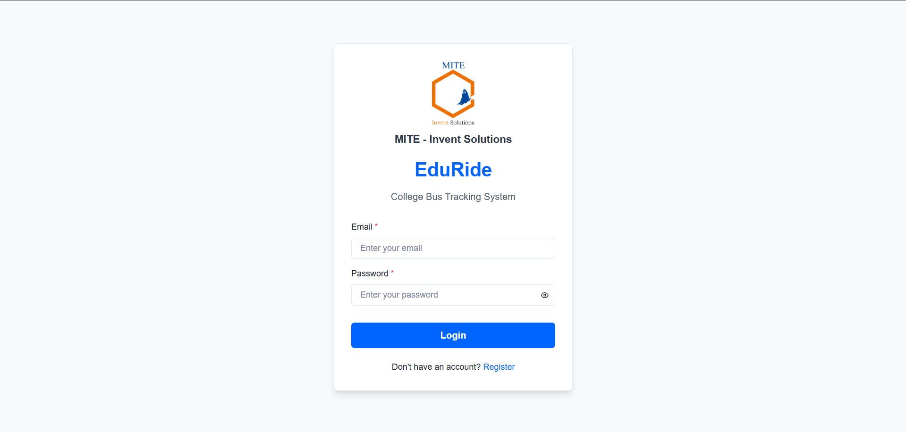
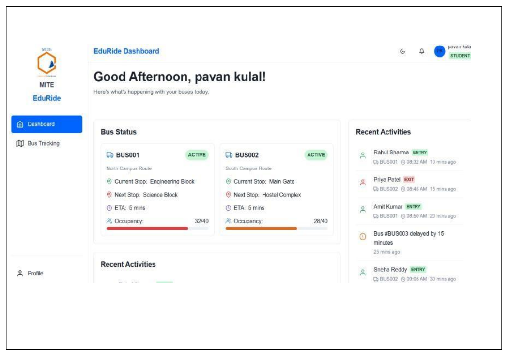
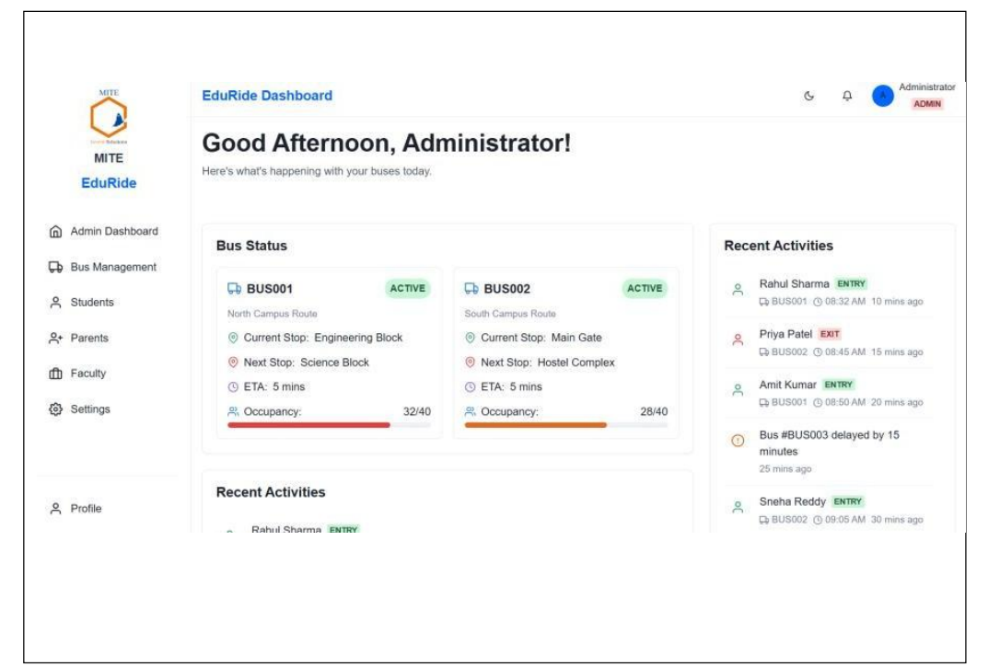
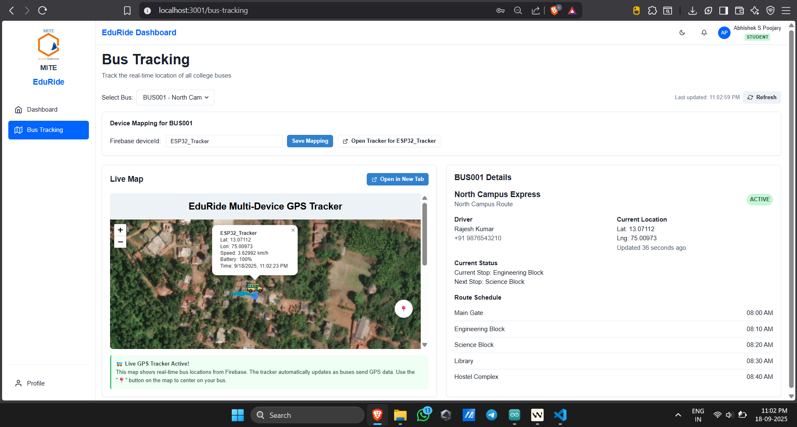
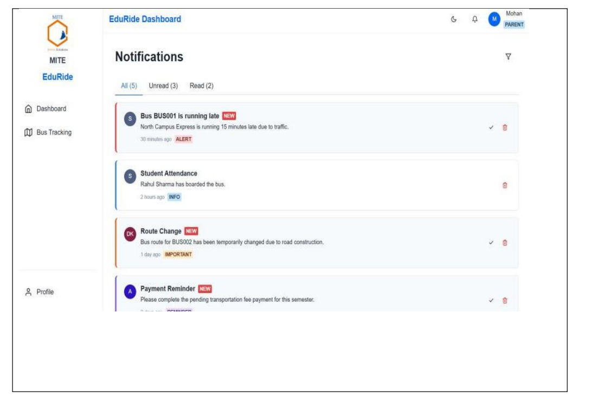

# 🚍 EduRide – College Bus Tracking and Attendance System

EduRide is a comprehensive bus tracking and attendance system for educational institutions. It combines RFID-based attendance tracking with real-time GPS location monitoring to provide a complete solution for managing college bus transportation.

## 🔧 Technologies Used

| Component | Technology / Module Used |
|-----------|-------------------------|
| Frontend | React.js, Chakra UI |
| Backend | Node.js (Express.js) |
| Database | MongoDB |
| Live GPS | Arduino + GPS Module (Neo-6M) |
| RFID Detector | Arduino + MFRC522 RFID module |
| Communication | Wi-Fi (ESP8266/ESP32), HTTP POST requests to API |
| Notifications | SMS (via Twilio) / Email alerts |
| Access Control | Servo-controlled door via ESP32 + RC522 |

## 🏗️ System Architecture

```
         +-------------------+
         |   RFID Reader     |
         | (RC522 + Arduino) |
         +--------+----------+
                  |
         Sends UID to API via Wi-Fi (ESP8266/ESP32)
                  |
                  v
+---------------------------------------------------+
|                  EduRide Backend (API)            |
|  - Built with Node.js + Express                   |
|  - Receives RFID + GPS data                       |
|  - Stores to MongoDB                              |
+---------------------------------------------------+
                  ^
                  |
     Sends bus location periodically via GPS Module
     (Arduino + Neo-6M + Wi-Fi Module)
                  |
         +--------+----------+
         |    GPS Tracker    |
         | (Arduino System)  |
         +-------------------+
```

## 🚀 Features

- **Live Bus Tracking**: Real-time GPS tracking of all buses on a map
- **RFID Attendance**: Automated student attendance tracking using RFID cards
- **Multi-User Roles**: Admin, Faculty, Parent, and Student access levels
- **Parent Notifications**: Automatic SMS/Email alerts when students board/exit buses or when fees are pending
- **Fare Lookup**: CSV-driven bus fare directory exposed via API and UI
- **Servo Access Control**: Bus doors unlock only when RFID scan belongs to a student with cleared fees
- **Attendance Reports**: Comprehensive reporting and analytics
- **Route Management**: Define and manage bus routes and stops

## 🔐 Bus Door Access Flow

1. **Scan** – Student taps their RFID card on the RC522 connected to an ESP32.
2. **Verify** – ESP32 posts `{ uid, busId }` to `POST /api/rfid`.
3. **Decision** – Backend checks `paymentStatus`.
   - `paid/exempt`: Attendance is logged, parents get entry/exit notification, API responds with `allowEntry: true`.
   - `pending/overdue`: API responds with `allowEntry: false`, parent receives a “fee pending” alert.
4. **Action** – ESP32 reads `allowEntry`. If `true`, it drives the servo to open the bus door for a few seconds, then locks again. Otherwise, the door remains locked.

> The ready-to-upload sketch lives in `arduino/access_control/access_control.ino`. Update Wi-Fi credentials, server IP, and bus ID before flashing. Requires `WiFi.h`, `MFRC522`, `ESP32Servo`, and `ArduinoJson`.

## 📋 Project Structure

```
eduride/
├── backend/             # Node.js backend API
│   ├── controllers/     # API controllers
│   ├── models/          # MongoDB models
│   ├── routes/          # API routes
│   ├── middleware/      # Express middleware
│   ├── services/        # Business logic services
│   └── server.js        # Entry point
├── frontend/            # React.js frontend
│   ├── public/          # Static files
│   └── src/             # React source code
│       ├── components/  # UI components
│       ├── pages/       # Page components
│       ├── context/     # React context
│       └── services/    # API services
└── arduino/            # Arduino / ESP32 code
    ├── gps_tracker/     # GPS tracker code
    ├── rfid_detector/   # Basic RFID sample
    └── access_control/  # ESP32 + RC522 + servo gate controller
```

## 🛠️ Setup Instructions

### Backend Setup

1. Navigate to the backend directory:
   ```
   cd backend
   ```

2. Install dependencies:
   ```
   npm install
   ```

3. Configure environment variables in `.env` file

4. Start the server:
   ```
   npm start
   ```
   
### Frontend Setup

1. Navigate to the frontend directory:
   ```
   cd frontend
   ```

2. Install dependencies:
   ```
   npm install
   ```

3. Start the development server:
   ```
   npm start
   ```

### Arduino Setup

1. Install the required libraries in Arduino IDE:
   - ESP8266WiFi / WiFi.h / WiFiNINA (based on board)
   - MFRC522 (RFID)
   - TinyGPS++ (GPS tracker sketch)
   - ArduinoJson (HTTP payloads)
   - ESP32Servo (for servo door control on ESP32)

2. Upload the respective code to your Arduino devices

## 👥 User Roles

- **Admin**: Complete system access and management
- **Faculty**: Monitor bus locations and student attendance
- **Parent**: Track their children's bus and receive notifications
- **Student**: View bus schedules and their attendance records

## 📱 API Endpoints

### Authentication
- `POST /api/users/register` - Register a new user
- `POST /api/users/login` - User login

### Location Tracking
- `POST /api/location` - Record new location from GPS device
- `GET /api/location/bus/:busId` - Get latest location of a specific bus

### RFID Attendance & Access Control
- `POST /api/rfid` - Record new RFID scan, returns `allowEntry` and triggers servo/notifications
- `GET /api/rfid/student/:studentId` - Get attendance records for a specific student
- `GET /api/rfid/bus/:busId` - Attendance list for a bus
- `GET /api/rfid/today` - Today's attendance snapshot (admin)

### Fare Directory
- `GET /api/fares` - List fares with optional `region` and `search` filters
- `GET /api/fares/regions` - Distinct region list for filters

### User Management
- `GET /api/users/profile` - Get user profile
- `PUT /api/users/profile` - Update user profile

### Bus Management
- `POST /api/buses` - Create a new bus (admin only)
- `GET /api/buses` - Get all buses

### Notifications
- `GET /api/notifications` - Get all notifications for the logged-in user
- `POST /api/notifications/send` - Send a new notification (admin only)

## 🌟 Screenshots

### 📱 Application Screenshots

#### Login Page


#### Student Dashboard


#### Admin Dashboard


#### Bus Tracking


#### Notifications



## 🛠️ Environment Variables

Create a `.env` file in the backend directory with the following variables:

```
# Server Configuration
PORT=5000
NODE_ENV=development

# MongoDB
MONGO_URI=your_mongodb_connection_string

# JWT
JWT_SECRET=your_jwt_secret
JWT_EXPIRE=30d

# Twilio (for SMS notifications)
TWILIO_ACCOUNT_SID=your_twilio_sid
TWILIO_AUTH_TOKEN=your_twilio_token
TWILIO_PHONE_NUMBER=your_twilio_phone
```

## 🧪 Testing

To run tests for the backend:

```bash
cd backend
npm test
```

For frontend testing:

```bash
cd frontend
npm test
```

## 🚀 Deployment

### Backend Deployment
1. Set `NODE_ENV=production` in your environment variables
2. Install production dependencies:
   ```bash
   npm install --production
   ```
3. Start the server using a process manager like PM2:
   ```bash
   pm2 start server.js --name eduride-backend
   ```

### Frontend Deployment
1. Build the production version:
   ```bash
   cd frontend
   npm run build
   ```
2. Deploy the `build` folder to your preferred static hosting service (Netlify, Vercel, etc.)

## 🐛 Troubleshooting

### Common Issues

1. **RFID Module Not Detected**
   - Check wiring connections
   - Verify the correct SPI pins are used
   - Ensure proper power supply (3.3V)

2. **GPS Not Getting Fix**
   - Ensure clear view of the sky
   - Check antenna connection
   - Verify baud rate settings

3. **API Connection Issues**
   - Check if the backend server is running
   - Verify CORS settings in the backend
   - Check network connectivity


## 📝 License

This project is licensed under the MIT License - see the [LICENSE](LICENSE) file for details.

## 🙏 Acknowledgments

- [React](https://reactjs.org/)
- [Node.js](https://nodejs.org/)
- [MongoDB](https://www.mongodb.com/)
- [Arduino](https://www.arduino.cc/)
- All the amazing open-source libraries used in this project
